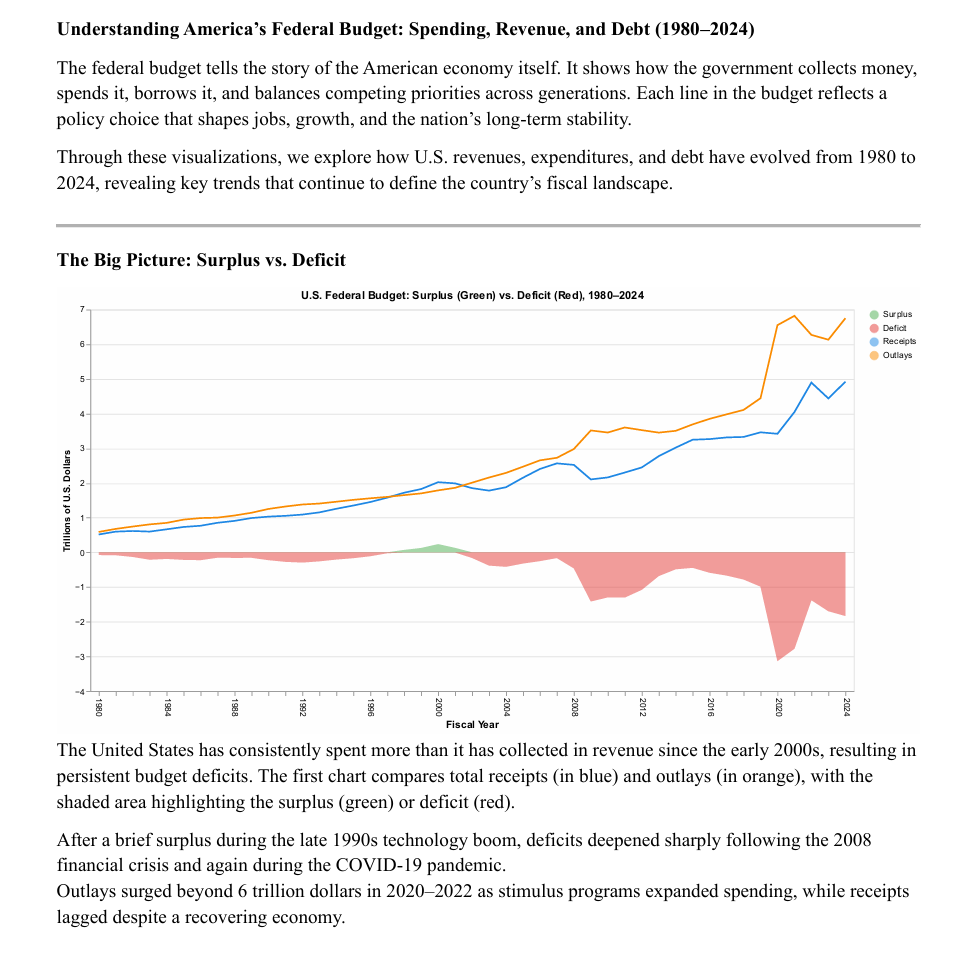
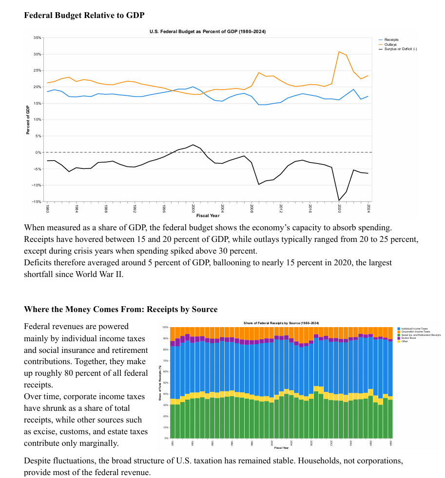
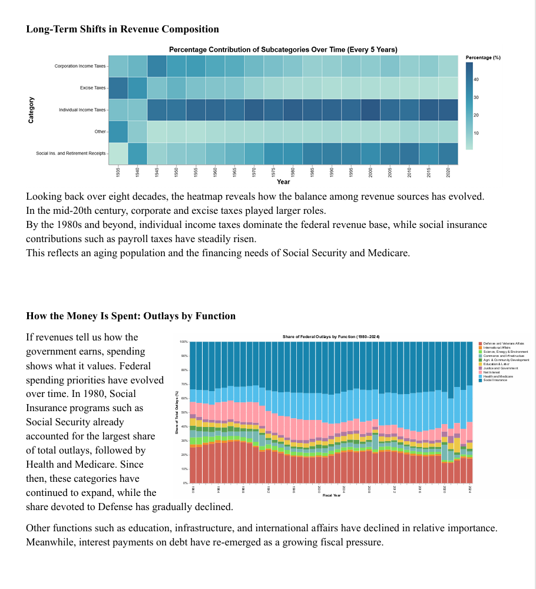
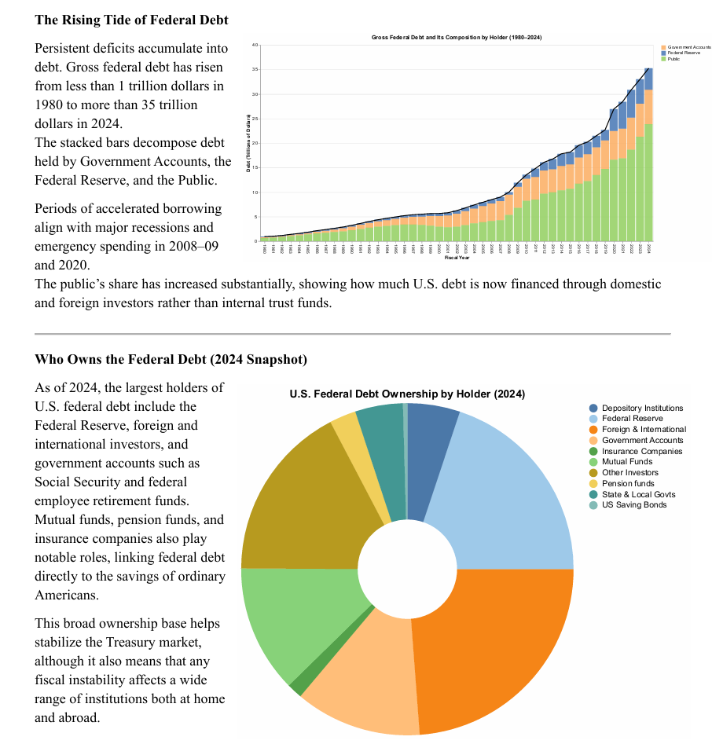
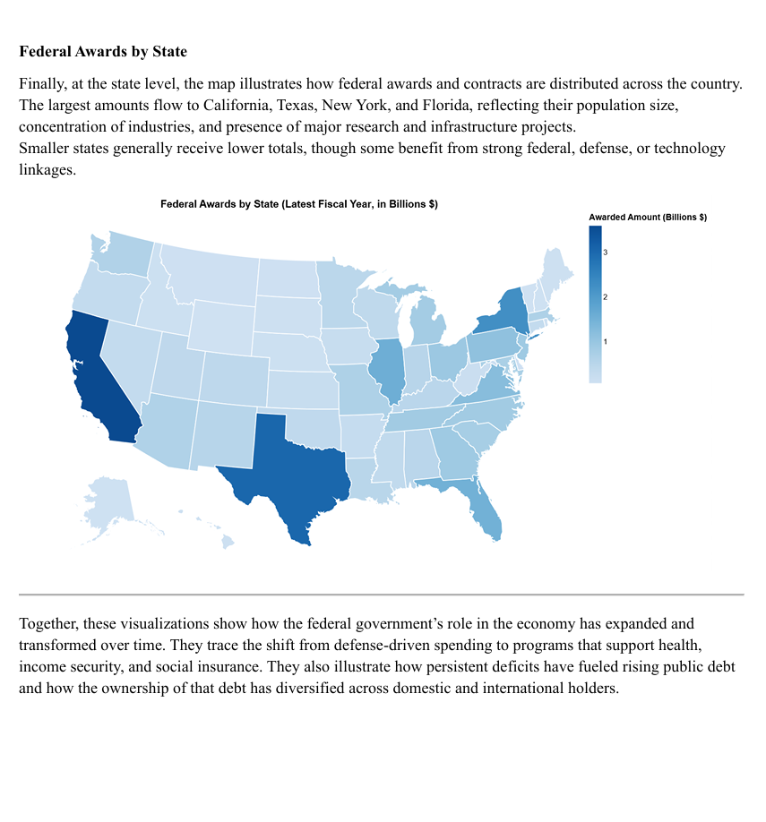
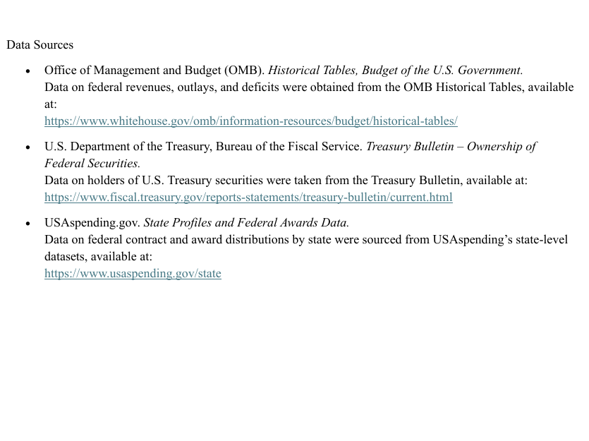

# US-Budget
Visualization of U.S. federal budget trends
Raabiyaal Ishaq 

## Description

This project visualizes how U.S. federal revenues, spending, and debt have evolved from 1980 to 2024.
It highlights major fiscal trends and shifts in national priorities using data from OMB, Treasury, and USAspending.gov.
The goal is to make the federal budget’s long-term patterns clear, accessible, and data-driven.

## Data Sources

Data Sources 

• Office of Management and Budget (OMB). Historical Tables, Budget of the U.S. Government. 
Data on federal revenues, outlays, and deficits were obtained from the OMB Historical Tables, available 
at: 
https://www.whitehouse.gov/omb/information-resources/budget/historical-tables/ 

• U.S. Department of the Treasury, Bureau of the Fiscal Service. Treasury Bulletin – Ownership of 
Federal Securities. 
Data on holders of U.S. Treasury securities were taken from the Treasury Bulletin, available at: 
https://www.fiscal.treasury.gov/reports-statements/treasury-bulletin/current.html 

• USAspending.gov. State Profiles and Federal Awards Data. 
Data on federal contract and award distributions by state were sourced from USAspending’s state-level 
datasets, available at: 
https://www.usaspending.gov/state